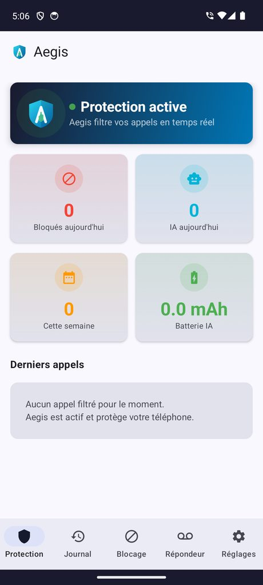
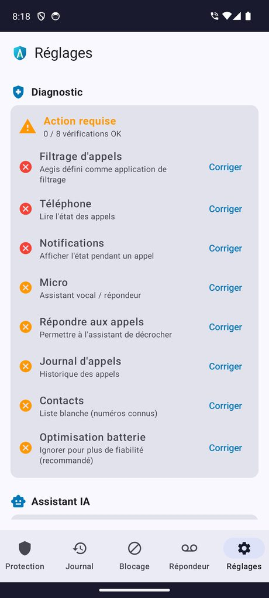
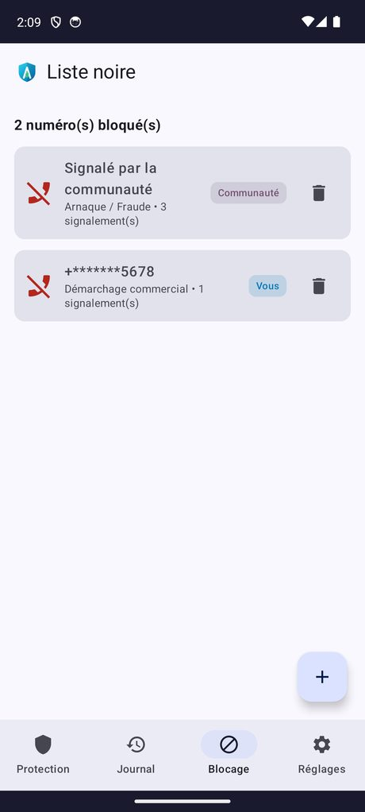

  

<h1 align="center">Aegis</h1>

  <b>Filtre d'appels intelligent</b> 
  Bloque le démarchage et les arnaques téléphoniques · Traitement 100&nbsp;% local · RGPD · Gratuit

  

  ~1,6&nbsp;Mo · Android&nbsp;8.0+ · <a href="https://cyberlogic91-dev.github.io/aegis-app/">Page de téléchargement</a>

---

## 📱 Captures

  
  
  

## ✨ Fonctionnalités

- 🛡️ **Blocage en temps réel** — filtre les appels sans consommer de batterie en veille
- 📍 **Localisation de l'appel** — provenance géographique du numéro (région FR ou pays)
- 👤 **Identification des contacts** — affiche le nom du contact ; vos contacts ne sont jamais bloqués
- 📞 **Type de ligne & VoIP** — mobile, fixe, VoIP/non-géographique ou surtaxé
- 👥 **Base communautaire** — 930+ numéros malveillants référencés, synchronisés via une jauge animée (empreintes SHA-256 anonymes)
- 🔄 **Mises à jour automatiques** — vérifie GitHub et propose d'installer la nouvelle version en un geste
- 🔔 **Aegis s'ouvre pendant l'appel** — fiche d'identification affichée par-dessus l'écran d'appel entrant
- 📵 **Préfixes ARCEP + Bloctel & 33700** — blocage réglementaire et signalement officiel

---

  © 2026 <b>Mike Mon</b> — Licence gratuite à usage personnel (logiciel propriétaire)

