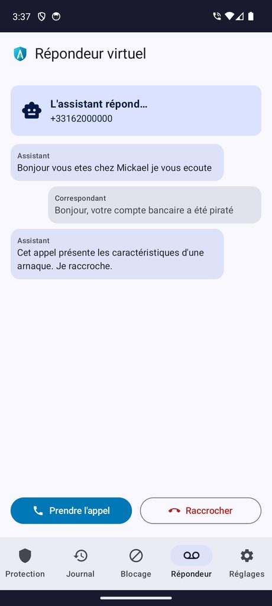
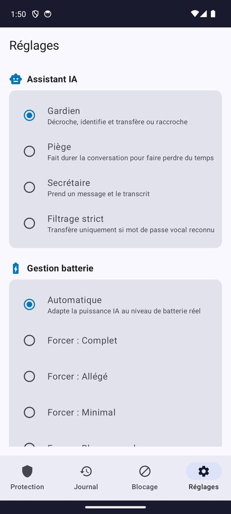

  

<h1 align="center">Aegis</h1>

  <b>Filtre d'appels intelligent</b> 
  Bloque le démarchage et les arnaques téléphoniques · Assistant IA 100&nbsp;% embarqué · RGPD · Gratuit

  

  ~1,6&nbsp;Mo · Android&nbsp;8.0+ · <a href="https://cyberlogic91-dev.github.io/aegis-app/">Page de téléchargement</a>

---

## 📱 Captures

  
  
  
  

## ✨ Fonctionnalités

- 🛡️ **Blocage en temps réel** — filtre les appels sans consommer de batterie en veille
- 🤖 **Répondeur virtuel IA** — l'assistant décroche, transcrit, et vous pouvez reprendre l'appel
- 👥 **Base communautaire** — numéros signalés partagés sous forme d'empreintes anonymes
- 📵 **Préfixes ARCEP + Bloctel & 33700** — blocage réglementaire et signalement officiel

---

  © 2026 <b>Cyberlogic</b> — Licence gratuite à usage personnel (logiciel propriétaire) 
  <a href="https://www.cyberlogic.fr">www.cyberlogic.fr</a>

